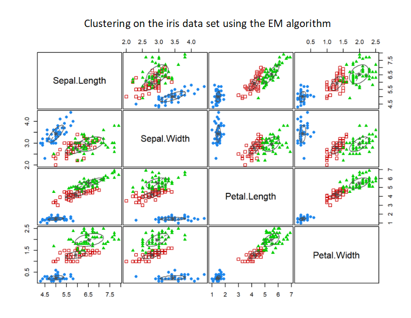
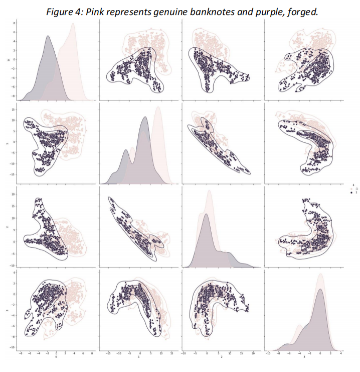
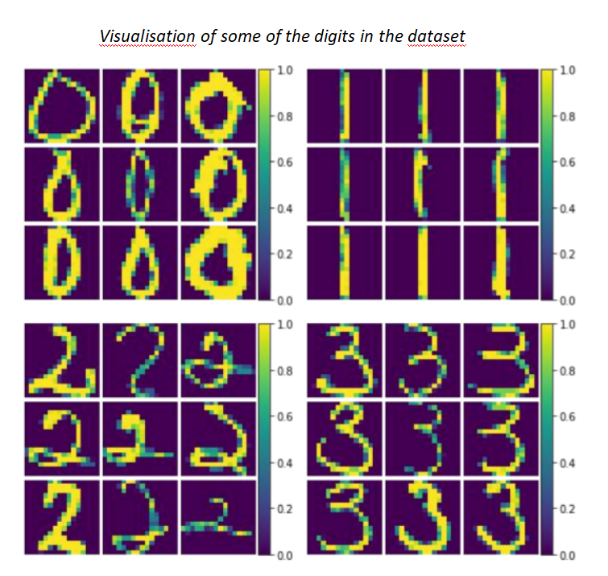
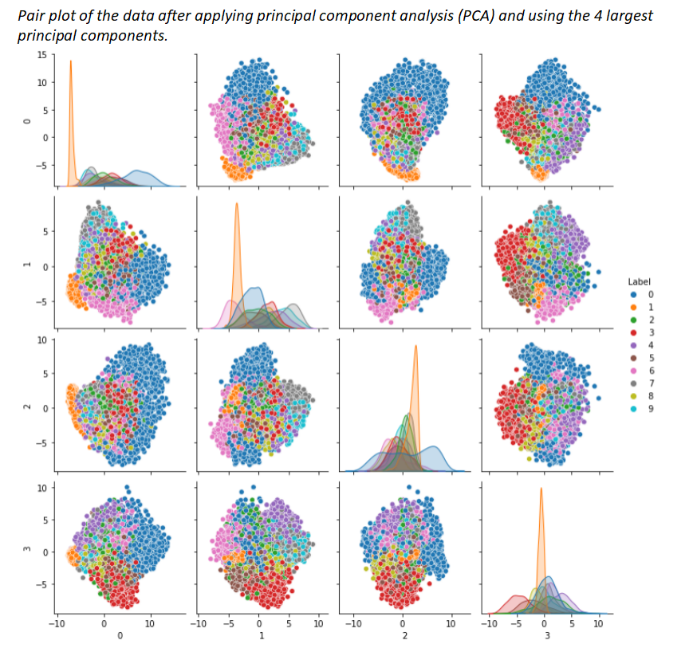
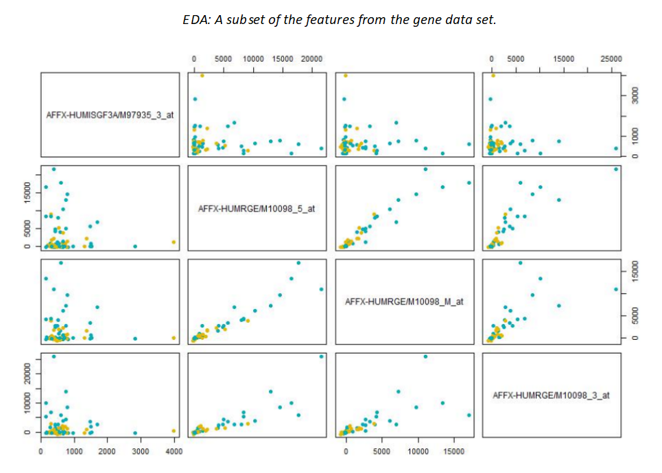
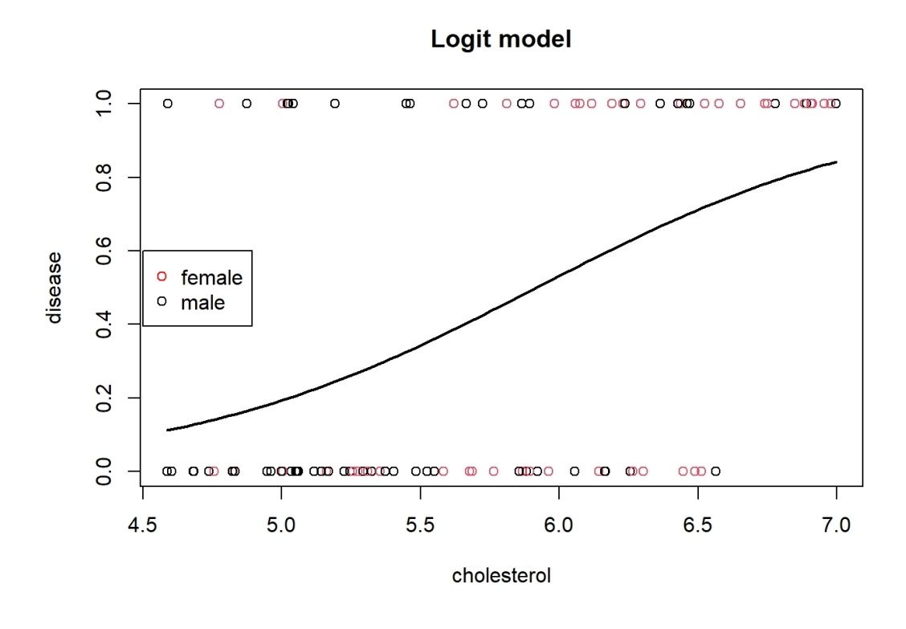
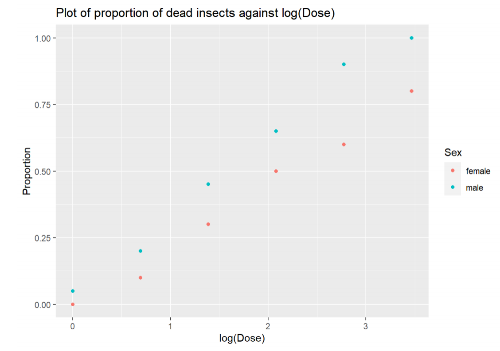

# Data Science Related University Courses

In the final year of my mathematics degree, I decided that I wanted to pursue a data science career and took as many machine learning and statistics courses as I was able to. Below are two courses I am particularly proud of, and I have given summaries of all the projects/assignments I did for each course. ***Click on the assignment titles (in blue) for links to the repositories where you can see all my work including the code.***

I will also be posting some of the personal data science projects that I have done/am currently working on, but that is still a work in progress.

---

## Course: STAT3006 - Statistical Learning (High Distinction)

### [Assignment 1: A writing task on Breimans famous paper "Statistical Modelling: The Two Cultures" (Essay)](https://github.com/Kaiaysez/STAT3006-Assignment-1)
* Discussion on machine learning vs statistical methods.
* Discussion on modelling and model validation.

### [Assignment 2: EDA, multivariate hypothesis testing, and clustering (Code: R)](https://github.com/Kaiaysez/STAT3006-Assignment-2) 

* Exploratory data analysis and multivariate hypothesis testing on the iris dataset.
* Mathematical derivation of the EM algorithm update equations.
* Comparing and contrasting EM and K-Means, implementation in R.
* Model selection via gap statistic and the Bayesian Information Criterion (BIC). 

### [Assignment 3: Supervised learning (Code: Python)](https://github.com/Kaiaysez/STAT3006-Assignment-3)

  
   

* Bayes classifier and classification loss.
* Visualizing and classifying time series data.
* Writing and coding a linear least squares support vector machine (SVM) from scratch.
* Using the implemented linear least squares SVM to classify real and fake bank notes.

### [Assignment 4: High dimensional data (Code: Python + R)](https://github.com/Kaiaysez/STAT3006-Assignment-4)

  
   

  
   

* Performing dimensionality reduction on handwritten digits (MNIST dataset) via auto-encoders and principle component analysis (PCA) in R. 
* Carrying out multivariate hypothesis testing and false discovery rate (FDR) methods in R to test whether there is a difference in distribution of gene expression levels between Acute Lymphoblastic Leukemia cells and Acute Myeloid Leukemia cells.
* Implementing elastic net regression via the glmnet package in R.

## Course: STAT3500 - Applied Modern Statistics (High Distinction)

### [Assignment 1: Statistical modelling - Multiple linear regression and logistic regression (Code: R)](https://github.com/Kaiaysez/STAT3500-Assignment-1)

* Implementing multiple linear regression and determining significant covariates.
* Residual analysis, checking model assumptions.
* Implementing and interpreting logit and probit models.

### [Assignment 2: Statistical modelling - Generalized linear models (Code: R)](https://github.com/Kaiaysez/STAT3500-Assignment-2)

  
   

* Implementing generalized linear models (GLM) for non linear data.
* Identifying the correct GLM family and link function for modelling various problems.
* EDA, interaction terms, and model selection.

### [Assignment 3: Mathematical statistics - Properties of the EM algorithm](https://github.com/Kaiaysez/STAT3500-Assignment-3)
* Proving properties of the regular exponential family.
* Proving properties of the EM algorithm for Gaussian Mixture Models and deriving the update equations.
* Maximum likelihood estimation (MLE) in the context of the EM algorithm.

### [Assignment 4: Implementing the EM algorithm and hypothesis testing via bootstrapping (Code: R)](https://github.com/Kaiaysez/STAT3500-Assignment-4)
* Implementing the EM algorithm for Gaussian mixture models in R.
* Selecting the number of clusters using the Bayesian Information Criterion (BIC).
* Parameter estimation and hypothesis testing via parametric and non-parametric bootstraps.
