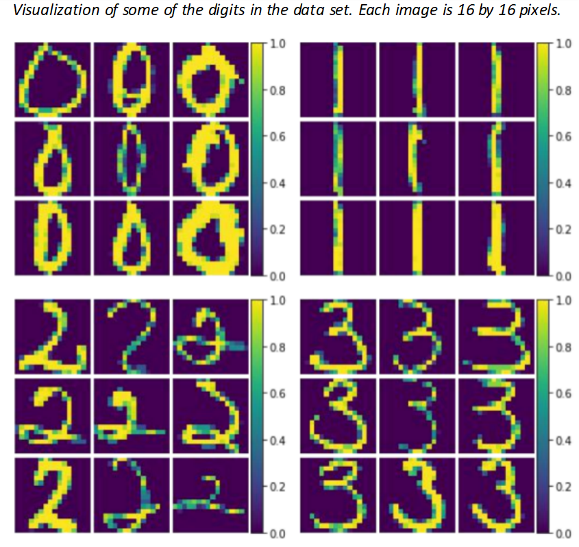

# Data Science Portfolio (Machine learning/Statistics University Coursework + Personal Projects)

In the final year of my mathematics degree, I decided that I wanted to pursue a data science career and took as many practical, project based machine learning and statistics courses as I was able to. Below are two courses I am particularly proud of, and I have given summaries of all the projects/assignments I did for each course. ***Click on the assignment titles (in blue) for links to the repositories where you can see all my work including the code.***

***To read about my personal deep learning project on estimating the probability of potting a ball in billiards and other personal projects, scroll to the bottom.***

---

## Course: STAT3006 - Statistical Learning (High Distinction)

### [Assignment 1: A writing task on Breimans famous paper "Statistical Modelling: The Two Cultures" (Essay)](https://github.com/Kaiaysez/STAT3006-Assignment-1)
* Discussion on machine learning vs statistical methods.
* Discussion on modelling and model validation.

### [Assignment 2: EDA, multivariate hypothesis testing, and clustering (Code: R)](https://github.com/Kaiaysez/STAT3006-Assignment-2) 

* Exploratory data analysis and multivariate hypothesis testing on the iris dataset.
* Mathematical derivation of the EM algorithm update equations.
* Comparing and contrasting EM and K-Means, implementation in R.
* Model selection via gap statistic and the Bayesian Information Criterion (BIC). 

### [Assignment 3: Supervised learning (Code: Python)](https://github.com/Kaiaysez/STAT3006-Assignment-3)

  
   

* Bayes classifier and classification loss.
* Visualizing and classifying time series data.
* Writing and coding a linear least squares support vector machine (SVM) from scratch.
* Using the implemented linear least squares SVM to classify real and fake bank notes.

### [Assignment 4: High dimensional data (Code: Python + R)](https://github.com/Kaiaysez/STAT3006-Assignment-4)

  
   

  
   

* Performing dimensionality reduction on handwritten digits (MNIST dataset) via auto-encoders and principle component analysis (PCA) in R. 
* Carrying out multivariate hypothesis testing and false discovery rate (FDR) methods in R to test whether there is a difference in distribution of gene expression levels between Acute Lymphoblastic Leukemia cells and Acute Myeloid Leukemia cells.
* Implementing elastic net regression via the glmnet package in R.

## Course: STAT3500 - Applied Modern Statistics (High Distinction)

### [Assignment 1: Statistical modelling - Multiple linear regression and logistic regression (Code: R)](https://github.com/Kaiaysez/STAT3500-Assignment-1)

* Implementing multiple linear regression and determining significant covariates.
* Residual analysis, checking model assumptions.
* Implementing and interpreting logit and probit models.

### [Assignment 2: Statistical modelling - Generalized linear models (Code: R)](https://github.com/Kaiaysez/STAT3500-Assignment-2)

  
   

* Implementing generalized linear models (GLM) for non linear data.
* Identifying the correct GLM family and link function for modelling various problems.
* EDA, interaction terms, and model selection.

### [Assignment 3: Mathematical statistics - Properties of the EM algorithm](https://github.com/Kaiaysez/STAT3500-Assignment-3)
* Proving properties of the regular exponential family.
* Proving properties of the EM algorithm for Gaussian Mixture Models and deriving the update equations.
* Maximum likelihood estimation (MLE) in the context of the EM algorithm.

### [Assignment 4: Implementing the EM algorithm and hypothesis testing via bootstrapping (Code: R)](https://github.com/Kaiaysez/STAT3500-Assignment-4)
* Implementing the EM algorithm for Gaussian mixture models in R.
* Selecting the number of clusters using the Bayesian Information Criterion (BIC).
* Parameter estimation and hypothesis testing via parametric and non-parametric bootstraps.

## Computer Vision Deep Learning Project: Estimating the probability of potting a ball in billiards using a convolutional neural network.

  
   

  
   

Aims:
* Designing and implementing a deep convolutional neural network (CNN) for distinguishing between "good" and "bad" positions in billiards.
* Testing different CNN architectures in an attempt to overcome the domain specific problem of requiring a large effective receptive field size to capture important information such as the position of the object balls, cue ball, cue stick, pockets and rails relative to each other.
* Visualizing the filters and feature maps to see if the model comes up with intuitive heuristics for prediction.
* Using temperature scaling to calibrate the model so that the output can be interpreted as probabilities instead of just black and white classification.

This is still a work in progress. **I expect to have a link to the github repo by early-mid February** once I am satisfied with the work. At the moment, I have designed a working model that can give decent predictions with roughly 70% accuracy on and a specificity of 60% on validation set. The latter is an important metric since the model has been trained as a binary classifier, and roughly 57% of the training data are labelled as successful shots. Training was done using Google Colab's free GPU's. As a comparison, my own human predictive accuracy is roughly 80%, and someone who does not play pool or is a beginner would almost certainly perform worse than the model. 

**The ultimate aim is to design a CNN architecture that can pick up useful intuitive heuristics.** This is a very difficult problem because CNN's are great at picking up important local structures in images. However, in pool, the best heuristics tend to be global. For example, the cue stick, cue ball, the target ball and the target pocket are all far apart from each other, so it is necessary that the effective receptive field of neurons is large. On the other hand, there *are* useful simple local heuristics such as a ball hanging over a pocket, balls stuck to the rails or balls clumped up together near the cue ball. These are much more likely to be picked up by the CNN. Visualizing the feature maps would help greatly in examining this. This will be my next step followed by increasing the sample size (I have lots of data but it takes time to gather it as I am working on the project alone), and finally implementing temperature scaling to calibrate the model to give good probability estimates.
